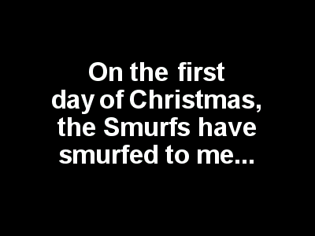

<h1 align="center">The 12 Days of Christmas
  <h3 align="center">Written in Rust</h3>
</h1>

 
        

 

  
&ensp;Click <i><u>here</u></i> to view a description of this program 

  
  &ensp;&ensp;Programatically, "The 12 Days of Christmas" has been constructed in different programming languages and in multiple ways.&ensp;&ensp;What follows is my rendition as written using the Rust language.
   
   
  &ensp;&ensp;Within the for loop of the main function, each of the inclusive 12 days is being passed to the gen_verse function.&ensp;The first line within gen_verse formats the day/number argument as an ordinal number, i.e. (1st, 2nd, 3rd, 4th, ...) and assigns the value to the variable 'ordinal_suffix'.&ensp; &ensp;Next, work is performed with the one consistent phrase in the lyric _"On the {} day of Christmas my true love sent to me:"._&ensp;&ensp;This phrase is converted, along with the ordinal_suffix variable, into a string using the format! macro, which is assigned to the variable 'begin'.
   
   
  &ensp;&ensp;The final piece of the function deals with displaying the Christmas presents.&ensp;&ensp;A constant array housing the gifts is constructed in decending order.&ensp;&ensp;After skipping '12 - n' items in the array, beginning with the first item, which is "Twelve drummers drumming", the remaining items are iterated over for that day and any previous day(s).&ensp;&ensp;For each iteration, a new line character is appended and then the lyric is appended to the 'begin' variable.&ensp;&ensp;At the completion of that days' iteration, the 'begin' variable is returned from the gen_verse function to the calling function and printed.&ensp;&ensp;This process is completed for each 'day' value passed to gen_verse.&ensp;&ensp;The output can be viewed in the image below.
   
   
  Thanks for reading and do reach out and let me know if you have any questions or concerns.&nbsp;&nbsp;Click 'Star' if you like the program.&nbsp;&nbsp;All suggestions, constructive, even non-constructive, will be welcomed.&nbsp;&nbsp;The source code can be viewed in the [src/main](https://github.com/nagashi/xmas_carol/blob/main/src/main.rs) folder for those unfamiliar with the Rust language.
 
  
 

12 Days of Christmas output

        

 

[![MIT licensed][mit-badge]][mit-url]&nbsp;&nbsp;

 
 

### License

This project is licensed under the&nbsp;[MIT license](LICENSE).

[mit-badge]: https://img.shields.io/badge/license-MIT-blue.svg
[mit-url]: LICENSE
### Contribution

Unless you explicitly state otherwise, any contribution intentionally submitted
for inclusion in Tracing by you, shall be licensed as MIT, without any additional
terms or conditions.

